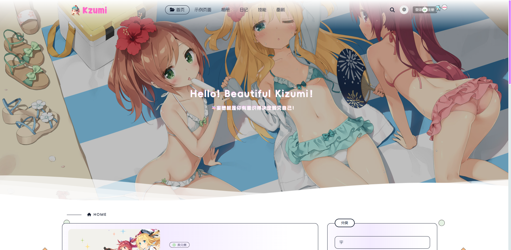

# Kizumi WordPress 主题
主题文档：[https://docs.kizumi.mysqil.com](https://docs.kizumi.mysqil.com)




## 📖 主题简介

Kizumi 是一款专为 ACG（动画、漫画、游戏）爱好者设计的现代化 WordPress 主题。基于原始 Lolimeow 主题重构开发，融合了 Astro-Mizuki 主题的设计元素，提供简洁、高效且易于定制的网站体验。

### ✨ 主要特色

- 🎨 **ACG 风格设计** - 专为二次元文化爱好者打造的视觉体验
- 🌙 **三模式切换** - 支持明亮、暗黑、自动三种主题模式
- 📱 **响应式布局** - 完美适配桌面、平板、手机等各种设备
- ⚡ **性能优化** - 原生前端开发，加载速度快，SEO 友好
- 🔧 **高度可定制** - 丰富的主题选项，满足个性化需求

## 🚀 核心功能

### 📝 内容管理
- **文章系统** - 支持多种文章格式和自定义字段
- **分类系统** - 自定义分类目录，方便内容组织
- **标签系统** - 标签云功能，支持文章分类
- **友情链接** - 直接在后端添加友情链接
- **相册功能** - 独立的图片展示系统，支持分类管理
- **日记系统** - 个人日记功能，记录生活点滴
- **技能管理** - 展示个人技能和能力的专业页面

### 👥 用户系统
- **用户注册/登录** - 完整的用户管理系统
- **用户中心** - 个人资料管理、订单查看、VIP 功能
- **会员系统** - 支持 VIP 会员功能和充值系统
- **用户权限** - 灵活的用户权限管理

### 💬 互动功能
- **评论系统** - 优化的评论功能，支持表情包
- **社交分享** - 集成多种社交媒体分享功能
- **消息通知** - 邮件通知系统，及时推送重要信息

### 🎨 界面定制
- **布局选择** - 单栏/双栏布局自由切换
- **边框效果** - 多种边框样式（无边框、漫画边框、阴影边框、线条边框）
- **图片灯箱** - 图片灯箱，点击图片可以放大

### ⚡ 性能优化
- **图片懒加载** - 提升页面加载速度
- **CDN 支持** - 静态资源 CDN 加速
- **代码压缩** - CSS/JS 文件自动压缩
- **缓存优化** - 智能缓存机制

## 📦 安装指南

### 系统要求
- WordPress 6.0 或更高版本
- PHP 7.4 或更高版本
- MySQL 5.6 或更高版本

### 安装步骤

1. **下载主题**
   ```bash
   # 下载主题文件到 WordPress 主题目录
   wp-content/themes/kizumi/
   ```

2. **激活主题**
   - 登录 WordPress 后台
   - 进入「外观」→「主题」
   - 找到 Kizumi 主题并点击「激活」

3. **基础配置**
   - 进入「外观」→「主题选项」
   - 根据需要配置各项设置
   - 保存设置并查看效果

## ⚙️ 配置说明

### 基础设置
- **博客布局**：选择单栏或双栏布局
- **布局边框**：设置页面边框效果
- **懒加载**：配置图片懒加载占位图
- **页面动画**：开启/关闭页面过渡动画

### Banner 设置
- **首页横幅**：设置首页展示横幅
- **背景图片**：自定义背景图片
- **标语设置**：配置网站标语和描述

### SEO 优化
- **标题优化**：自动生成 SEO 友好的页面标题
- **关键词设置**：配置网站关键词
- **描述信息**：设置网站描述信息

### 用户功能
- **注册设置**：配置用户注册选项
- **登录页面**：自定义登录页面样式
- **用户中心**：设置用户中心功能
- **VIP 系统**：配置会员功能

## 📄 页面模板

主题提供了丰富的页面模板：

### 基础页面
- `p-page.php` - 标准页面模板
- `p-page-nosidebar.php` - 无侧边栏页面
- `p-links.php` - 友情链接页面
- `p-go.php` / `p-goto.php` - 跳转页面

### 功能页面
- `p-gallery.php` - 相册展示页面
- `p-skills.php` - 技能展示页面
- `p-signin.php` / `p-signup.php` - 登录/注册页面
- `p-user_center.php` - 用户中心页面
- `p-reset_password.php` - 密码重置页面

### 用户中心模板
- `user-home.php` - 用户首页
- `user-money.php` - 余额管理
- `user-order.php` - 订单管理
- `user-vip.php` - VIP 功能
- `user-comment.php` - 评论管理

## 🔧 小工具

主题内置多个实用小工具：

- **搜索框** (`widget-search.php`) - 站内搜索功能
- **用户信息** (`widget-userinfo.php`) - 显示用户登录状态
- **文章列表** (`widget-postlist.php`) - 最新/热门文章展示
- **标签云** (`widget-tags.php`) - 标签云展示
- **分类目录** (`widget-category.php`) - 分类目录导航
- **评论列表** (`widget-comments.php`) - 最新评论展示
- **归档** (`widget-archive.php`) - 文章归档
- **广告位** (`widget-ads.php`) - 广告展示
- **相册** (`gallery-widget.php`) - 相册展示

## 🎨 自定义开发

### 主题结构
```
lolimeow/
├── assets/                 # 静态资源
│   ├── css/               # 样式文件
│   ├── js/                # JavaScript 文件
│   ├── images/            # 图片资源
│   └── fonts/             # 字体文件
├── core/                  # 核心功能
│   ├── module/            # 功能模块
│   ├── panel/             # 主题选项面板
│   └── widgets/           # 小工具
├── page/                  # 页面模板
│   └── template/          # 子模板
├── *.php                  # 主题模板文件
└── style.css              # 主样式文件
```

### 核心模块说明
- `fun-basis.php` - 基础功能模块
- `fun-user.php` - 用户系统模块
- `fun-comments.php` - 评论系统模块
- `fun-gallery.php` - 相册功能模块
- `fun-seo.php` - SEO 优化模块
- `fun-optimize.php` - 性能优化模块
## 🙏 致谢

- 基于原始 [Lolimoew](https://github.com/baomihuahua/lolimeow) 模板


感谢您选择 Kizumi 主题！如果您在使用过程中遇到任何问题，欢迎通过官方渠道联系我们。让我们一起打造更好的 ACG 主题体验！ 🎉
